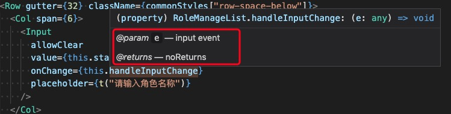

## jsdoc

> emm...算是找到了关于编程注释的文章了，所以记录一下  
> 写js的注释，如果想要注释详细一下，尤其是给class或者是function写注释，写出详细的入参和出参，就能够让人在编辑器(eg: vscode)中，光标放在调用函数名上面，可以看到
相对详细的注释，很有帮助

### result


### what
- 写法
  - @[tags] {dataType} explain

```javascript
  /**
   * @param {string} lastName - 名
   * @returns {string} fullName - 姓名
   */
  function getFullName(lastName) {return name + ' wplay'}
```

- tags
  - @param
  - @returns
  - @todo
  - 

### docs
[很齐全的JSDoc](https://devdocs.io/jsdoc/about-getting-started)
[tsdoc的github](https://github.com/microsoft/tsdoc)