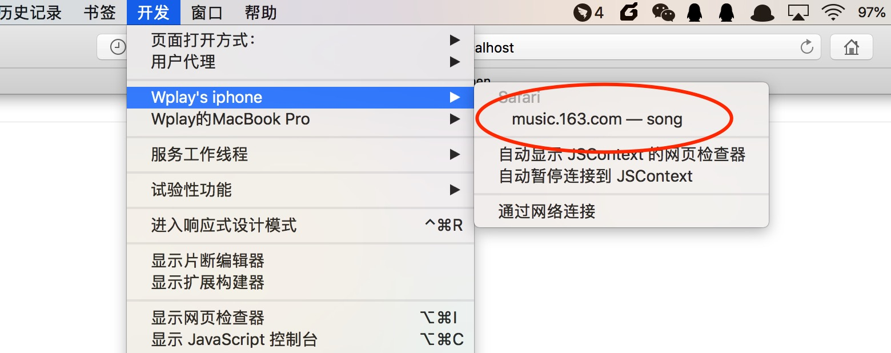
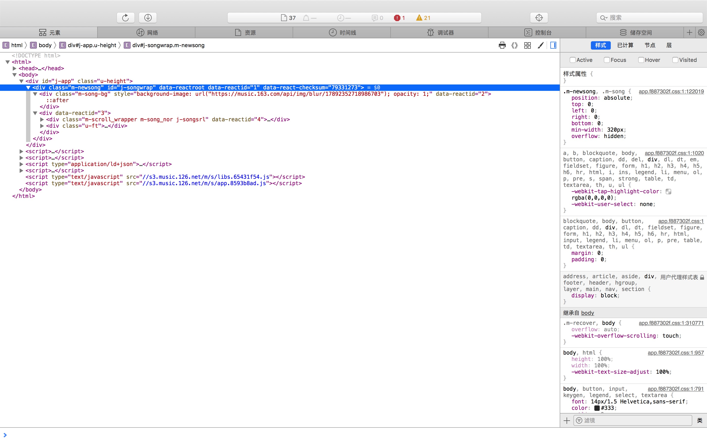
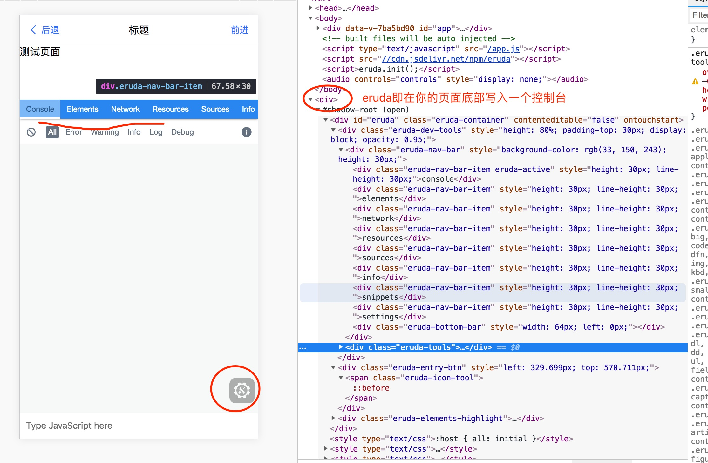
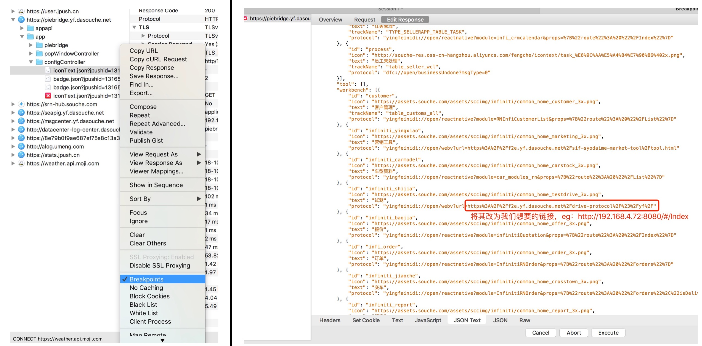

## 开发移动端h5时如何在iOS中进行调试

> 前端开发时，通常要进行调试，一方面查看代码逻辑是否有问题，另外一方面就是兼容各个设备。  
> pc的web可以使用浏览器自带的调试工具即可进行调试，但是移动端提供的webview通常没有控制台可供我们调试,  
> 于是有了这篇文章，相对比较针对性的关于我司项目开发移动端h5如何在iOS调试

- 使用safari+mac进行页面的布局调试
- eruda/v-console工具在app中进行调试


### 使用safari进行调试

> 同时启用 safari(iOS)/支持调试的测试版app 和 safari(mac)，并且保持iphone和mac的有线连接状态  

操作步骤
- 检查iOS的safari是否支持`Web检查器`, 如果没有 --> `手机设置` - `safari` - `高级` - 启用 `Web检查器`
- 检查mac的safari是否有`开发`选项 如果没有`开发`选项 --> `偏好设置` - `高级` - 勾选 `在菜单栏中显示"开发"菜单`
- 在iphone的safari中打开目标页面，并保持页面在主屏幕上(如果app是测试环境并且支持webview被safari调试的话，也可以是webview页面)
- mac的safari， `开发` --> `xxx's phone` --> 点击`目标页面`，safari(mac)会弹出一个控制台用来debug

<image width="300" src="./imgs/1.jpeg" />





### 使用eruda/v-console
- [eruda git传送门](https://github.com/liriliri/eruda)
- [v-console git传送门](https://github.com/Tencent/vConsole)

>  eruda 和 v-console 是很类似的东西，基本就是在html中写入一段fix定位的代码，里面是一个定制控制台  
> 我们这里主要通过 eruda 讲一下这类工具



#### `eruda`引入
- 官方提供了多种引入方法，基本都是引入`eruda.js`, 初始化`eruda.init()`
- 不过由于我们公司可能有些h5项目是使用`SSR`（server side rendering）服务端渲染页面，而且我们产线没有必要引入eruda这么一个东西，所以推荐使用 `cdn 引入 eruda` + `NODE_ENV 条件判断是否引入并且init eruda`

```推荐引入eruda方法
    // add eruda when not in production
    if (process.env.NODE_ENV !== 'prod' || process.env.NODE_ENV !== 'production') {
        let src = '//cdn.jsdelivr.net/npm/eruda'
        document.write(`<script src=${src}></script>`)
        document.write('<script>eruda.init();</script>')
    }
```

### 具体开发中的示例
> 特定化一下场景，我们的前端h5基本上都内嵌在自己的app中，想要在开发中调试h5和app的通信（Jockey）功能使用效果，  
> 我们可以通过charles代理，breakpoint打断点，修改后台返回的链接，将其指向我们自己启动的测试环境链接

- 举个例子，英菲尼迪app（类似大风车）, 将宫格中的试驾入口变为我们自己的本地服务的链接，用来调试h5和native的通信

1. 负责渲染九宫格的接口 `https://piebridge.yf.dasouche.net/app/configController/iconText.json`,
2. 我们对该接口`右键设置breakpoints`，然后重新进行请求，
3. charles会在该接口进行两次中断，第一次允许你`edit request`， 第二次允许你`edit response`,
4. 我们在第二次中断时修改`response`，随便找一个protocol修改为我们想要的url链接`eg: http://192.168.5.98:8080/#/Index`
5. 然后`excute`, 这个宫格入口便可以成为我们想要的本地链接




### 参考
- [调试手机页面](https://zhuanlan.zhihu.com/p/43215409)
- [iOS：Safari或Chrome调试Webview](https://www.jianshu.com/p/e4e3dedfe36b)
- [How to debug your mobile hybrid app on iOS](https://developers.redhat.com/blog/2017/07/12/how-to-debug-your-mobile-hybrid-app-on-ios/)