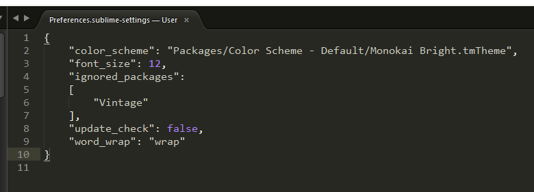
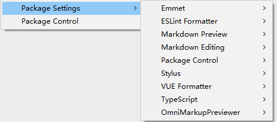
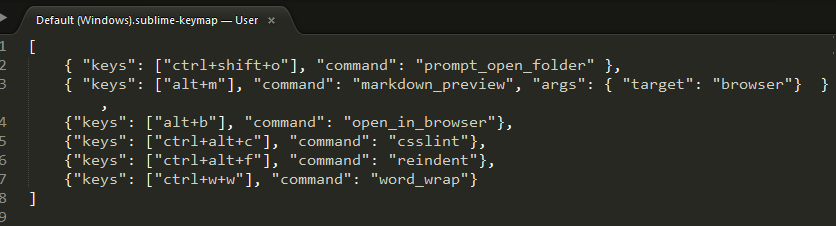

### 老版的sublime

- `sublime user setting`
    + 
    + 'update_check': false  `不再每次打开sublime就提示更新可用`

- `sublime package list`
    + 

- `sublime keybind setting`
    + 

**关于markdown+github，图片路径中()中写成img/1.png而不是/imgs/1.png**