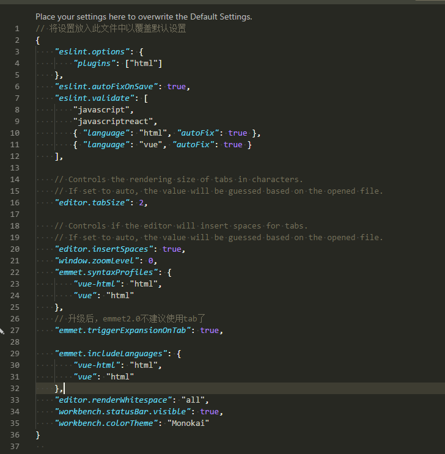

 - 卧槽，vscode自带的markdown不要太好看
 - 默认快捷键 `ctrl + shift + v`

 ### vscode installed extensions
 - angular 2 typeScript Emmit
 - Beautify
 - EditorConfig for VS Code
 - es-beautifier
 - ESLint  `useful`
 - language-stylus
 - Mark Jump
 - Mithril Emmet
 - Stylint
 - TabSpacer  `useful`
 - Tag-Jump
 - Vetur
 - vscode-elm-jump

 ### vscode extensions setting
 - 自定义配置截图
    

    > 通过配置，emmet 2.0能够继续使用tab键，并且再vue-template也使用tab
    
    > 可以通过`ctrl+s`在保存时自动进行一些简单的eslint的格式化

### vscode 一些操作
  - 安装了tabspacer之后，可以通过命令将`选中的/所有的`内容在space和tab之间进行格式化
    - 最初问题，因为css部分，stylus会因为tab和space并存而选择其中之一，并且在发现不同后，不再继续渲染css，这就尴尬了
    - 所以使用vscode敲代码，记得打开`view -> toggle Render Whitespace`,**重要**
 

