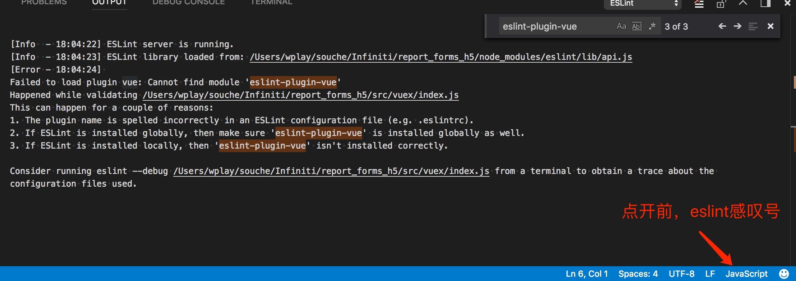

*** 记一次eslint的失败

> 最近，`vscode`中，发现`eslint`不灵了，不再去对错误进行`lint`，`autoFixOnSave`更是失效了.
> 一脸懵逼，删除`settings配置`，卸载`plugins`，都没用

- 最终，通读eslint之后，发现然并卵。
- 最终，机缘巧合之下，发现右下角有个eslint的感叹号，并不是`javaScript`,点开之后发现，如下图

- 我选择第三种方式，本地`npm install eslint-plugin-vue -D`
- **成功解决，完结散花**