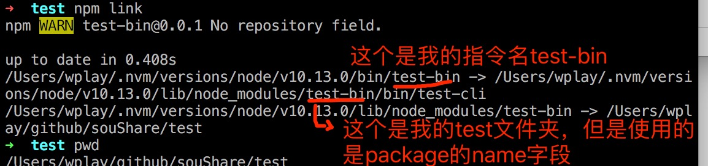
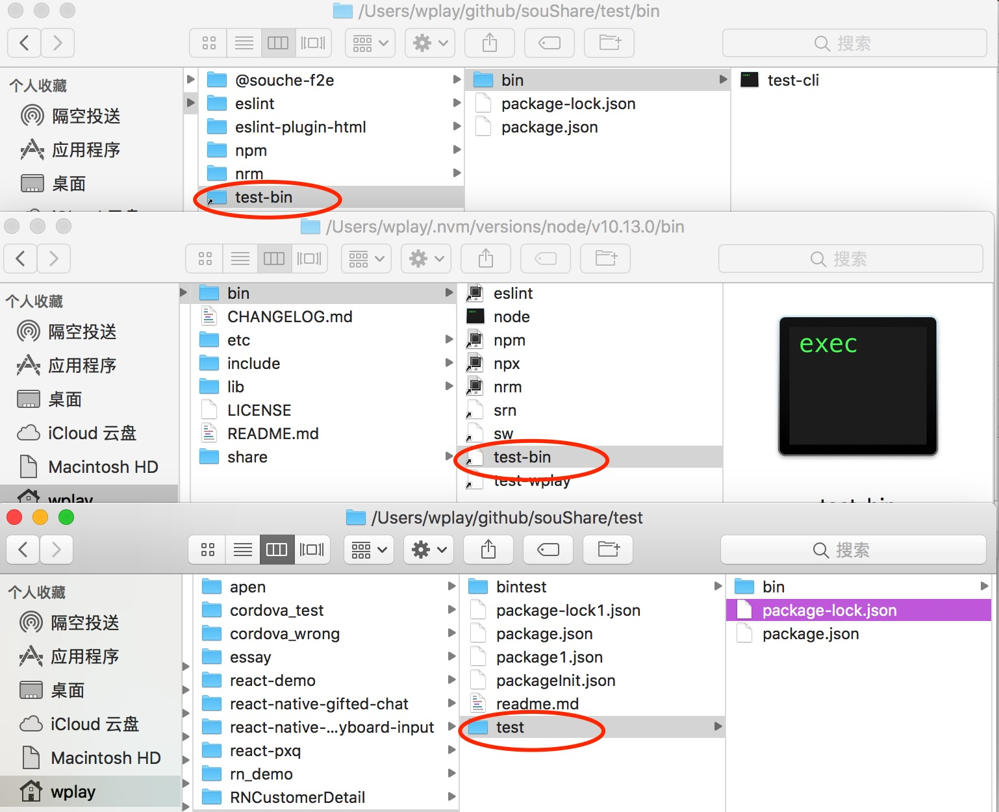

## 基于node的命令行工具 (share by 连海明)

### 详细步骤

1. mkdir test （创建文件夹）
2. cd test
3. npm init (生成package.json)
4. 在package.json 添加 bin 指令

```json
    "bin": {
        "test-bin": "./bin/test-cli"
    },
    "scripts": {
        "test": "test-bin param1"
    }
```

5. mkdir bin && touch ./bin/test-cli (在test文件夹中创建文件夹 bin 和 test-cli 文件)

6. write `!#/usr/bin/env node` in `./bin/test-cli` （设置test-cli文件支持node）

```
    #!/usr/bin/env node
    console.log('lets get all argments', process.argv);
    console.log('=======我是火辣辣的分割线========')
    console.log('lets get our arguments', process.argv.slice(2))
```

7. chmod +x ./bin/test-cli  (给test-cli文件添加`可执行`权限)
```
    $ chmod +x ./bin/test-cli
```

8. npm link (将bin中的指令添加到npm目录下的bin文件夹下)

9. 全局多出了可执行指令 test-bin (可以使用 `which test-bin` 查看位置)

10. 现在可以通过 `该文件夹下运行 npm run test` 或者 `全局运行 test-bin [params]`，执行`./bin/test-cli`文件。结果如下。


**最后，在 `./bin/test-cli` 书写node代码，将该cli功能完善吧。**

### 步骤细节解释

1. mkdir创建文件夹，touch创建文件
2. **which** `在PATH变量指定的路径中，搜索某个系统命令的位置，并且返回第一个搜索结果`  
    [参考博客：cnblogs —— which指令](http://www.cnblogs.com/peida/archive/2012/11/08/2759805.html)
3. **!#/usr/bin/env node** `指定脚本的解释程序为node， env表示可以去系统的环境Path中进行查找`  
    [参考博客：CSDN —— #!/usr/bin/env在脚本中的作用](https://blog.csdn.net/iamzhangzhuping/article/details/50425754)
4. **chmod指令** 给指定文件/目录设置权限 
    - `权限列表 —— r:read, w: write, x: execute, X: special execute .etc`  
    - `权限操作 —— +: add, -: remove, =: 添加指定权限，并且移除所以其他权限`  
    [参考：chmod命令](http://man.linuxde.net/chmod)  
    [参考：维基百科](https://en.wikipedia.org/wiki/Chmod) [中文版](https://zh.wikipedia.org/wiki/Chmod) `中文不全但是方便理解，英文全面但是有些晦涩，建议同时阅读`
5. **process.argv** 执行指令时带的参数（Array），从process.argv[2]开始才是自定义的参数
6. **npm link** 它的动作可能进行很多。但是在这里，仅仅是把package.json的bin指令列表复制到了全局  
    *ps: `node_modules/test-bin`是包的`name`名，而不是包的`路径`名*

    npm link 指令后结果图，我们可以看到，将全局中的`bin/test-bin`, `lib/node_modules/test-bin/bin/test-cli`, 和真实路径下的`test文件夹`, 三者关联了起来  

      
    
    我们可以通过下图更加直观的看到，生成了`test-cli文件`, `test-bin文件夹`这两个快捷方式，把三者串联了起来

    


### 疑惑
- Q1
在我的测试中，`npm link`和`npm install -g`都可以使`test-bin`被生成到全局，二者的输出如下，貌似有区别，但是在这里貌似没有影响。是吗？
```json

# npm link

➜  test npm link
npm WARN test-bin@0.0.1 No repository field.

up to date in 3.471s
/Users/wplay/.nvm/versions/node/v10.13.0/bin/test-bin -> /Users/wplay/.nvm/versions/node/v10.13.0/lib/node_modules/test-bin/bin/test-cli
/Users/wplay/.nvm/versions/node/v10.13.0/lib/node_modules/test-bin -> /Users/wplay/github/souShare/test

# npm install -g

➜  test npm install -g
/Users/wplay/.nvm/versions/node/v10.13.0/bin/test-bin -> /Users/wplay/.nvm/versions/node/v10.13.0/lib/node_modules/test-bin/bin/test-cli
+ test-bin@0.0.1
added 1 package from 1 contributor in 0.164s
```


### 写在最后的话

> 很抱歉将海明的分享拖了这么久才输出成文档，个中细节被我忘的七七八八了，我是按照海明的keynotes，自己稍微记的一点笔记，和网上[阮一峰的Node.js 命令行程序开发教程](http://www.ruanyifeng.com/blog/2015/05/command-line-with-node.html)才将它拼凑出来，分享中诸多遗漏的精彩的部分，希望各位有兴趣的话可以直接进行编辑和补充 (by 王平原)  
> 海明将当天分享的实操code临时放在了github上，有兴趣的同学可以去看看  [传送门](https://github.com/lianhaiming/sou)