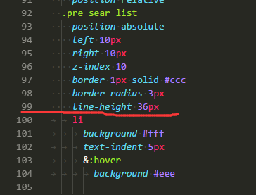

### 云平台项目总结

> 云平台项目，使用技术 vue + vuex + vue-router + elementUI + stylus
> 使用工具 vscode + chrome + eslint + iconfont

- vue核心思想，数据驱动，组件系统。 `状态管理数据`，通过简单的data/computed的变化，驱动整个系统运转
- 关于大量的表格，以及一些页面权限设置，最好的就是设置一个data `isLoaded`,需要的数据加载完以后再让它显示
- css和html的样式有时候不报错，但是也显示不出来（尤其是使用了stylus的css）,推荐使用vscode的`找不到了，反正能够显示是space还是tab`。在css\[lang="stylus"\]中，如果同时存在tab和space的书写方式，就会报错，如下图，红线以下不会显示

### 关于项目(vue)
- `mounted`貌似经常加载两次，所以我就放弃了它，使用`created`
- 除了methods，还经常使用`filters`
- `computed` 和 `watch`是个好东西，前者主要用来多个data的改变来决定一个值，后者是一个值的改变进行多个操作，
    + 但是有时候`this`的指向有些问题，我也懵逼，经验不足吧，当时出现错误的时候也没有处理好
- 定时器不会被清除，所以如果有定时器，请在离开路由之前将其清除，在`beforeDestroy`中`clear`即可
- **如何在axios中使用promise**
    + axios本身就是promise写出来的，所以后续就是`then`中添加`return`这么简单
    + 首先methods中的指定方法中，eg `getList`,对getDAta进行return，然后再在data.success中进行return
    + 这样子，就可以外部使用`this.getList().then(() => {this.getSubList})`了
    
- created的时候，只是dom没有加载，但是数据都已经加载完毕了，至少vuex是ok的

### 关于elementUI
- 栅格系统虽好，那是建立在没有UI的情况下。。。老实做人最好
- el-select中，v-model用来绑定真实的值
    - `el-option`列表中，:value代表的是真实的值(与父级的v-model交互用)，label代表的是显示的值
- v-if 和 v-for 不能同时在同一个标签中使用
    + v-for 中的 `:key`，绑定的必须是简单数据类型(Number/String/Boolean)

### 关于eslint
- 去除eslint的报错 (defined but never use)，两种方式，
    1. 更改总体的eslint的配置 不想讲
    2. 哪里需要就把该注释添加到哪里 `// eslint-disable-line no-unused-vars`

### 关于es6
- Object.assign只拷贝了一层，不是深度拷贝，我写了深度拷贝的代码。。。（但是在笔记本中，尴尬，后期在`常用.md`上传吧）

### 关于babel
- `...`功能, eg: `...mapGetters`,并不是es6提供的，而是babel提供的
    + 在`babelrc`中，`presets`中添加上'stage-2'才ok. **当然记得要npm安装babel-preset-stage-2**
